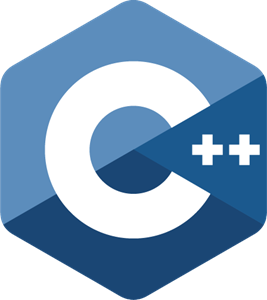
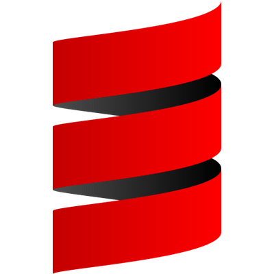
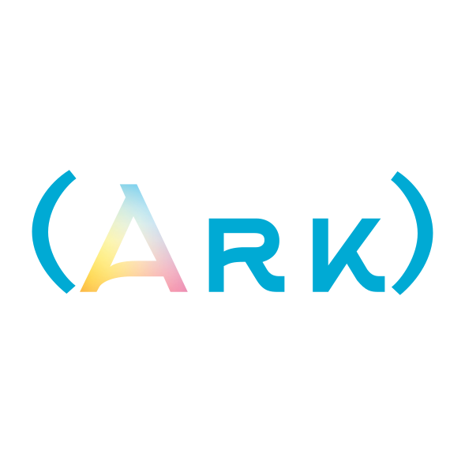
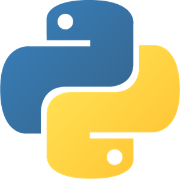
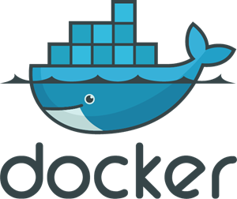
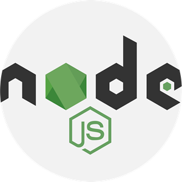

### Hello there, I'm Lexy

I do a lot of **scripting** in Bash, Python, and [ArkScript](https://arkscript-lang.dev) (my own language!), sometimes **web dev**, tinkering with **CI/CD** and Docker on my servers, **designing keyboards** in KeyCAD, and also **backend** work in Scala.

    <i>My <a href="https://superfola.github.io/">portfolio</a> lies here</i>,
    and my <a href="https://lexp.lt">blog is here</a>

    <ul>
        <li>🔭 I’m currently working on
            <ul>
                <li><a href=https://github.com/ArkScript-lang/Ark>ArkScript</a>, a Lisp inspired scripting language in C++20</li>
                <li><a href=https://github.com/SuperFola/Pataro>Pataro</a>, a C++17 rogue like engine based on <a href=https://github.com/libtcod/libtcod>libtcod</a></li>
            </ul>
        </li>
        <li>🌱 I’m currently learning advanced C++</li>
        <li>💬 Ask me about anything, I love teaching and learning</li>
        <li>📫 How to reach me <strong><a href=mailto:lexy@elranet.eu>lexy@elranet.eu</a></strong></li>
    </ul>

## Technlogies I'm using

    &nbsp;&nbsp;
    &nbsp;&nbsp;
    &nbsp;&nbsp;
    &nbsp;&nbsp;
    &nbsp;&nbsp;
    

