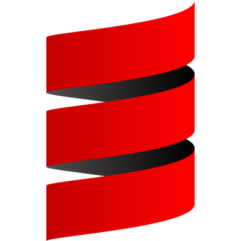

### Hello there, General Kenobi, I'm Alexandre (SuperFola) Plateau
#### A French devops, programming language dev, web dev and sometimes game dev

    <i>My <a href="https://superfola.github.io/">portfolio</a> lies here</i>

    <ul>
        <li>🔭 I’m currently working on
            <ul>
                <li><a href=https://github.com/ArkScript-lang/Ark>ArkScript</a>, a functional programming language for C++ projects</li>
                <li><a href=https://github.com/SuperFola/Pataro>Pataro</a>, a C++17 rogue like engine based <a href=https://github.com/libtcod/libtcod>libtcod</a></li>
            </ul>
        </li>
        <li>🌱 I’m currently learning advanced C++</li>
        <li>👯 I’m looking to collaborate on
            <ul>
                <li>websites</li>
                <li>games</li>
                <li>languages</li>
                <li>tools (as long as it's in C++ or Python)</li>
            </ul>
        </li>
        <li>💬 Ask me about anything, I love teaching and learning</li>
        <li>📫 How to reach me <strong><a href=mailto:lexplt.dev@gmail.com>lexplt.dev@gmail.com</a></strong></li>
    </ul>

## Technlogies I'm using

    &nbsp;&nbsp;
    &nbsp;&nbsp;
    &nbsp;&nbsp;
    &nbsp;&nbsp;
    &nbsp;&nbsp;
    

## My blog posts on dev.to
<!-- BLOG-POST-LIST:START -->
- [Finding bugs by fuzzing your code](https://dev.to/lexplt/finding-bugs-by-fuzzing-your-code-1b0e)
- [Making your project available through Homebrew](https://dev.to/lexplt/making-your-project-available-through-homebrew-1ll5)
- [Understanding tail-call optimization](https://dev.to/lexplt/understanding-tail-call-optimization-3562)
- [Making an authenticated API](https://dev.to/lexplt/making-an-authenticated-api-2paj)
- [GitHub actions are awesome](https://dev.to/lexplt/github-actions-are-awesome-3ggl)
<!-- BLOG-POST-LIST:END -->

    
    

    

